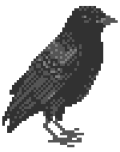

### Hi there! :wave:

## I am a Software Engineer who loves building things. Nowadays I mostly work on Java, Python & kdb+/q based applications development.

 

## Sample projects

<table>	
	<tr>
		<th>Web Application | API</th>
		<th>Repository</th>
	</tr>
	<tr>
		<th><a href="https://scenes-classifier.herokuapp.com">Scenes Classifier Web Application</a></th>
		<th>https://github.com/fabiogaiera/scenes-classifier</th>
	</tr>
	<tr>
		<th><a href="https://corn-diseases-classifier.herokuapp.com">Corn Diseases Classifier API</a></th>
		<th>https://github.com/fabiogaiera/corn-diseases-classifier</th>
	</tr>
</table>

## Technology Stack

### Programming Languages

* Java
* Python
* kdb+/q

### Databases

* Oracle
* MySQL

### Java Frameworks

* Spring Framework
* Spring Boot
* Spring Data
* Hibernate ORM
* JUnit
* Mockito

### Python Machine Learning Libraries     

* TensorFlow  
* scikit-learn  

### Python Data Analysis Libraries

* NumPy  
* pandas  

### Python Data Visualization Libraries 

* Matplotlib  
* seaborn  

### Python Frameworks  

* FastAPI

### Cloud Computing

* Heroku

### Containerization

* Docker
* Kubernetes

### DevOps

* Git
* Jenkins
* Octopus
* SonarQube